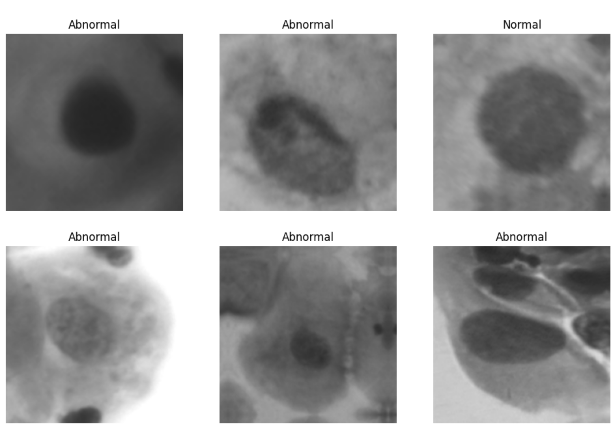
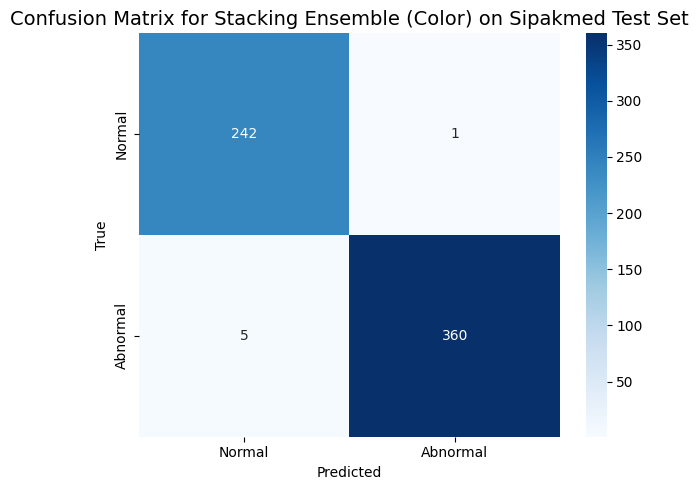
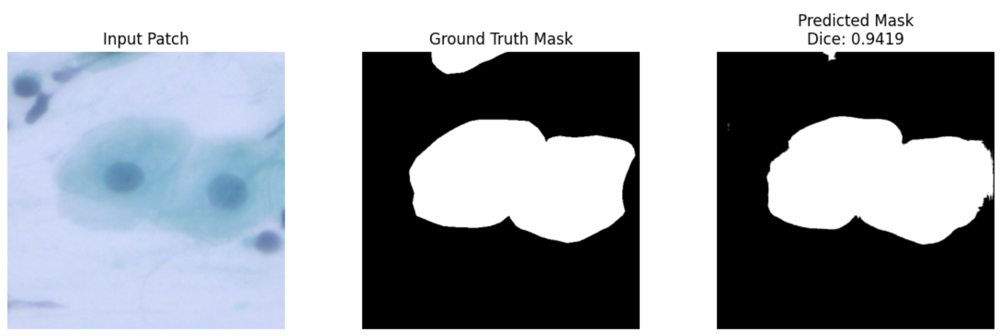
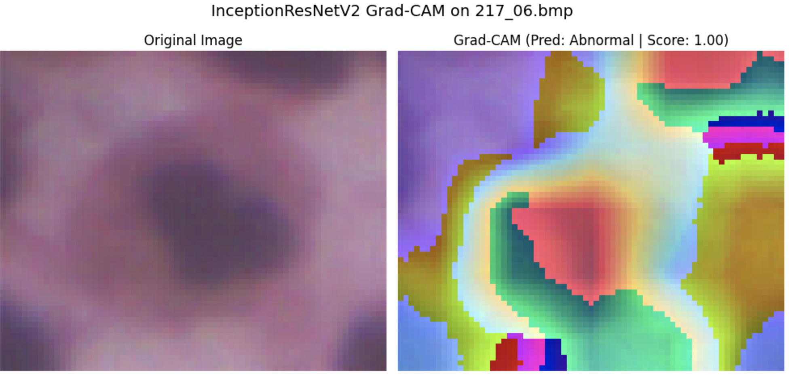

# A Multi-Faceted Deep Learning Framework for Enhanced Cervical Cancer Diagnosis

This repository contains the code and technical report for a binary classifier for Cervical Cancer Whole Slide Images (WSIs). Multiple strategies were tested, and our proposed model was developed to address the challenge.

The project features two distinct, independent pipelines:
1.  **High-Performance Ensemble:** Utilizes a stack of state-of-the-art models (VGG16, Xception, etc.) to achieve an accuracy of **~99% on the SIPaKMeD Dataset** and **~90% on the Herlev dataset**.
2.  **Lightweight Models:** Implements a custom **MRF-DCN classifier** and a **U-Net segmentation** model, achieving 93% classification accuracy with high efficiency.

All the data used in my project can be downloaded from the following links via Kaggle:
https://www.kaggle.com/datasets/prahladmehandiratta/cervical-cancer-largest-dataset-sipakmed
https://www.kaggle.com/datasets/yuvrajsinhachowdhury/herlev-dataset

## Project Structure

```
pap_smear_project/
├── configs/              # Project configurations (config.yml, config_test.yml)
├── data/
│   ├── patches/          # Generated patches for U-Net are stored here
│   └── raw/              # Raw datasets should be placed here
├── notebooks/            # Jupyter notebooks for experimentation
├── saved_models/         # Saved .keras models after training
├── scripts/              # Automation scripts for all pipelines
├── src/                  # Main Python source code
├── tests/                # Project tests
├── Dockerfile            # Docker configuration for containerization
├── .dockerignore         # Specifies files to exclude from the Docker image
└── README.md
```

## Setup Instructions

### 1. Clone the Repository

### 2. Download Data
Place the **Herlev** and **Sipakmed** datasets inside the `data/raw/` directory. The expected structure is:
```
data/raw/
├── HerlevData/
│   ├── test/
│   └── train/
├── im_Abnormal/
├── im_Carcinoma-in-situ/
├── ... (and other Sipakmed folders)
└── im_Superficial-Intermediate/
```
The data path is configured in `configs/config.yml`.

### 3. Environment Setup

You can set up the environment using Docker (recommended for consistency) or locally with a virtual environment.

#### Option A: Using Docker (Recommended)
This is the most reliable method.
**Prerequisites:** [Docker](https://www.docker.com/get-started) and, for GPU support, the [NVIDIA Container Toolkit](https://docs.nvidia.com/datacenter/cloud-native/container-toolkit/latest/install-guide.html).

1.  **Build the Docker image:**
    ```bash
    docker build -t pap-smear-project .
    ```
2.  **Run the container** (this mounts your project directory for live code changes):
    *   **With GPU:** `docker run -it --rm --gpus all -v $(pwd):/app pap-smear-project`
    *   **CPU only:** `docker run -it --rm -v $(pwd):/app pap-smear-project`

You are now inside the container's shell and can proceed to the execution steps.

#### Option B: Local Setup (venv)
1.  **Create a Virtual Environment:**
    ```bash
    python3 -m venv venv
    source venv/bin/activate  # On Windows: venv\Scripts\activate
    ```
2.  **Install Dependencies:**
    ```bash
    pip install --upgrade pip
    pip install -r requirements.txt
    pip install -r requirements-dev.txt
    ```
3.  **Make the Project "Editable":** This crucial step makes your `src` code importable.
    ```bash
    pip install -e .
    ```
4.  **macOS Users Only: Install SSL Certificates:** If you are on a Mac, run the `Install Certificates.command` script found in your Python 3.12 (or your version) Applications folder. This is required to download model weights.

## How to Run the Project

This repository contains two primary pipelines that can be run independently.

### Pipeline 1: High-Performance Ensemble Models
This is the main pipeline for training the ensemble of pre-trained models.

<p align="center">
    
</p>

#### **Step 1.1: Verify with a Dry Run (Recommended First)**
This tests the entire ensemble pipeline on a minimal, fake dataset to verify your environment.
```bash
bash scripts/run_dry_run.sh
```
*(Note: This script automatically calls `create_fake_dataset.py`.)*

#### **Step 1.2: Run the Full Training Pipeline**
This will run the entire process on the real dataset. **Warning:** This is computationally expensive.
```bash
bash scripts/run_full_training.sh
```
<p align="center">
    
</p>

### Pipeline 2: Lightweight MRF-DCN & U-Net Pipeline
This pipeline trains the custom lightweight MRF-DCN classifier and the U-Net segmentation model.

**To run the entire MRF-DCN and U-Net pipeline:**
```bash
bash scripts/run_mrf_dcn_unet_pipeline.sh
```
This single command will automatically:
1.  Generate (or unzip existing) image patches required for the U-Net.
2.  Train the MRF-DCN classifier.
3.  Train the U-Net segmenter.
4.  Evaluate both models on their respective test sets and display results.

<p align="center">
    
</p>


## Running Post-Training Analysis

### Grad-CAM Visualization
After training models (from Pipeline 1), you can run Grad-CAM analysis to visualize what parts of an image a model is focusing on.

1.  **Configure the Analysis:** Open `configs/config.yml` and edit the `gradcam_analysis` section to specify which trained model you want to inspect.
2.  **Run the Script:**
    ```bash
    bash scripts/run_gradcam_analysis.sh
    ```
This will generate and display plots showing the original images alongside their Grad-CAM heatmaps.


<p align="center">
    
</p>

## Running Tests
To run the static smoke tests, which quickly check for import errors and configuration issues, use `pytest`:
```bash
pytest
```
If all tests pass, your environment is likely configured correctly.
